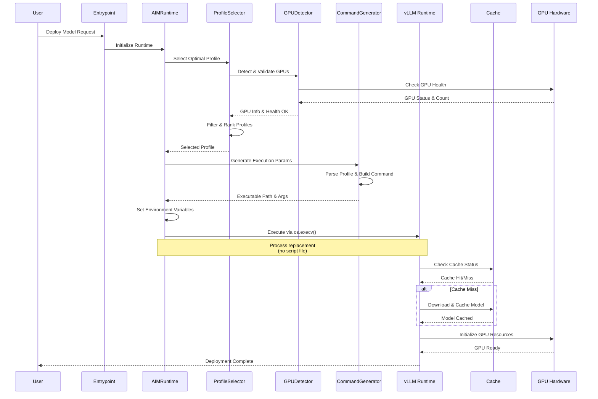

<!--
Copyright © Advanced Micro Devices, Inc., or its affiliates.

SPDX-License-Identifier: MIT
-->

# AIM Container Technical Architecture
>
> **Version**: 0.9
>
> **Scope**: This document describes the internal technical architecture of AIM *containers*. It deliberately excludes higher‑level orchestration (Kubernetes, Helm, Operators) to focus on what ships inside and immediately around a single container instance.

## 1. Introduction

**AMD Inference Microservice (AIM)** is a comprehensive framework for deploying and serving AI models on AMD hardware, specifically designed for AMD Instinct™ GPUs (MI300X, MI325X, MI350X, MI355X). AIM provides standardized profiles and configurations for efficient model inference across different hardware configurations, precision formats, and performance metrics. This document focuses on the architecture of AIM Containers.

### 1.1 Goals

The container provides a production‑ready, portable inference microservice for AMD Instinct GPUs delivering:

* Validated model profiles (YAML) for target hardware
* Intelligent hardware detection and adaptive configuration (GPU count, precision)
* Multiple inference engines (initial: vLLM; pluggable design for others such as SGLang)
* Precision format selection (based on GPU support, e.g. fp16, bf16, fp8, int8, int4)
* Tensor parallel scaling (1/2/4/8 GPU layouts) driven by profiles
* Support for integration with model caching & persistence acceleration layer
* Real‑time streaming responses and tool calling enablement
* Tool (function) calling enablement strategy
* Observability hooks (metrics/logging)

### 1.2 AIM Framework functionality out of scope for AIM Containers

* Cluster scheduling, autoscaling, or admission controllers
* Kubernetes CRDs / Operator logic
* CI/CD pipelines & publishing workflows
* External secret management and enterprise auth (future integration points only)
* Specific hardware performance benchmarks (this document defines the *how*, not the *how fast*)

## 2. High‑Level Component Map (In‑Container)

| Component | Responsibility |
|-----------|----------------|
| **AIM Runtime** ( `AIMRuntime` ) | Main orchestrator that coordinates the complete workflow. |
| **Profile Store** (mounted or baked) | Provides YAML profile + model spec documents. |
| **Profile Selector** ( `ProfileSelector` ) | Resolves optimal profile given model, GPUs, precision, engine. |
| **Command Generator** ( `CommandGenerator` ) | Produces runtime command, environment based on selected profile. |
| **GPU & Capability Detection** ( `GPUDetector` ) | Determines host/container/vLLM-visible GPU counts & characteristics with health checks. |
| **Engine Runtime** (vLLM) | Executes inference & streaming APIs. |
| **API Layer** (OpenAI‑compatible) | Accepts client requests (prompt, stream, tool invocation). |
| **Metrics & Logging** | Emits structured events, performance counters (future: tracing). |

## 3. Profile System

### 3.1 Artifacts

* **Profile Files**: Organized hierarchically under `/workspace/aim-runtime/profiles/` with fallback layers:
  + Model-specific: `/workspace/aim-runtime/profiles/<org>/<model>/*.yaml`
  + General profiles: `/workspace/aim-runtime/profiles/general/*.yaml`

  Example paths:


```
  /workspace/aim-runtime/profiles/meta-llama/llama-3.1-8b-instruct/vllm-mi300x-fp16-tp1-latency.yaml
  /workspace/aim-runtime/profiles/meta-llama/llama-3.1-8b-instruct/vllm-mi300x-fp16-tp1-throughput.yaml
  /workspace/aim-runtime/profiles/deepseek-ai/deepseek-r1/vllm-mi300x-bf16-tp8-throughput.yaml
  /workspace/aim-runtime/profiles/general/vllm-mi300x-fp16-tp1-latency.yaml
```

* **Profile Search Path**: Custom profiles supported via convention-based `custom/` directory.

  Search precedence:
  1. `/workspace/aim-runtime/profiles/custom/`
  2. `/workspace/aim-runtime/profiles/<org>/<model>/`
  3. `/workspace/aim-runtime/profiles/general/`

### 3.2 Profile Structure

Each profile YAML file follows a standardized structure with the following key sections:

**Model-Specific Profiles:**
* **`aim_id`**: The AIM container identifier (e.g., "meta-llama/Llama-3.1-8B-Instruct") - determines which profile set this belongs to
* **`model_id`**: The actual model to deploy (e.g., "meta-llama/Llama-3.1-8B-Instruct" or "amd/Llama-3.1-8B-Instruct-FP8-KV" for quantized models)

**General Profiles:**
* General profiles omit `aim_id` and `model_id` fields, making them applicable to any model

**All Profiles:**
* **`metadata`**: Structured information for profile selection and categorization:
  + `engine`: Backend engine (e.g., "vllm", "sglang")
  + `gpu`: Target GPU model (e.g., "MI300X", "MI325X")
  + `precision`: Data type precision (e.g., "fp16", "bf16", "fp8", "int8", "int4")
  + `gpu_count`: Number of GPUs for tensor parallelism (1, 2, 4, 8)
  + `metric`: Optimization target ("latency" or "throughput")
  + `manual_selection_only`: Boolean flag (true = only selectable via explicit `AIM_PROFILE_ID`)
  + `type`: Profile type classification ("optimized", "unoptimized", "preview", or "general")
* **`engine_args`**: Engine-specific command-line arguments and parameters
* **`env_vars`**: Environment variables to set during runtime execution

The metadata section enables intelligent profile selection by providing structured, machine-readable information about the profile's target configuration.

**Profile Type Classification**: The `type` field categorizes profiles based on their optimization status:
* `"optimized"`: Performance-tuned profiles with benchmarked configurations for specific model/hardware combinations
* `"unoptimized"`: Basic profiles with default or minimal tuning, suitable as starting points for experimentation
* `"general"`: Generic profiles applicable across multiple models, providing baseline configurations when model-specific profiles are unavailable
* `"preview"`: Performance-tuned profiles which do not reach the same level of performance as "optimized" profiles, intended for early access to new configurations

### 3.3 Schema & Integrity

The schema (JSON file in `schemas/` ) enforces structural correctness: required fields (metadata section with engine/GPU/precision/gpu_count/metric, engine sections, args). Schema validation ensures at least:
* Valid YAML structure
* Presence of complete metadata section with all required fields
* Engine argument validation
* GPU count validation (1, 2, 4, 8 for tensor parallelism)

Optional checks:
* Filename ↔ internal `profile_id` consistency

### 3.4 Selection Algorithm Overview

The `AIMRuntime` class orchestrates the entire workflow, utilizing `ProfileSelector` to find the optimal profile based on hardware configuration and user-specified arguments. The system includes an integrated GPU health check that ensures all detected GPUs are in a healthy state before proceeding - if any GPU shows utilization, the system will show a warning.

The profile selector executes these stages:

1. **GPU Detection & Health Check** – Identify host, container, and vLLM-usable GPU counts and verify all GPUs are healthy
2. **Profile Search & Collection** – Gather all candidate profiles from search paths (custom, model-specific, and general)
3. **General Profile Fallback Control** – If `AIM_ALLOW_GENERAL_PROFILE_FALLBACK=false`, mark all general profiles as manual-selection-only (excluded from automatic selection but still listable)
4. **Metadata-Based Filtering** – Apply sequential filters based on:
   - Detected GPU model (e.g., MI300X, MI325X)
   - Available GPU count (profile gpu_count ≤ detected count)
   - Engine preference (vLLM by default)
   - Optimization metric (latency vs throughput)
   - `manual-selection-only` flag (profiles with this flag are excluded from automatic selection)
5. **Precision Ordering** – Sort remaining profiles by precision preference (lower precision preferred for "auto")
6. **Type ordering** - Sort remaining profiles by type in the order of: optimized, preview, unoptimized, general.
7. **Profile Selection** – Return the best-matched profile from the ordered list

The selection algorithm leverages the structured metadata section to efficiently filter and rank profiles based on the runtime environment and user preferences. This metadata-driven approach ensures optimal profile selection while maintaining deterministic fallback behavior.

**General Profile Fallback Behavior**:
- **Base containers** (`AIM_ALLOW_GENERAL_PROFILE_FALLBACK=true` by default): General profiles can be automatically selected when no model-specific profiles match
- **Model-specific containers** (`AIM_ALLOW_GENERAL_PROFILE_FALLBACK=false` by default): General profiles are marked as manual-selection-only, requiring explicit selection via `AIM_PROFILE_ID`
- This ensures model-specific containers prioritize their optimized profiles while still allowing users to manually override with general profiles if needed

### 3.5 Profile Example

Below is an illustrative example of a profile file for `meta-llama/Llama-3.1-8B-Instruct`, optimized for latency on a single MI300X GPU.

 `profiles/meta-llama/Llama-3.1-8B-Instruct/vllm-mi300x-fp8-tp1-latency.yaml`

```yaml
aim_id: meta-llama/Llama-3.1-8B-Instruct
model_id: amd/Llama-3.1-8B-Instruct-FP8-KV
metadata:
  engine: vllm
  gpu: MI300X
  precision: fp8
  gpu_count: 1
  metric: latency
  manual_selection_only: false
  type: optimized
engine_args:
  swap-space: 64
  tensor-parallel-size: 1
  max-num-seqs: 512
  kv-cache-dtype: fp8
  max-seq-len-to-capture: 32768
  max-num-batched-tokens: 1024
  max-model-len: 32768
  no-enable-prefix-caching:
  no-enable-log-requests:
  disable-uvicorn-access-log:
  no-trust-remote-code:
  gpu-memory-utilization: 0.9
  distributed_executor_backend: mp
  async-scheduling:
env_vars:
  GPU_ARCHS: "gfx942"
  HSA_NO_SCRATCH_RECLAIM: "1"
  VLLM_USE_AITER_TRITON_ROPE: "1"
  VLLM_ROCM_USE_AITER: "1"
  VLLM_ROCM_USE_AITER_RMSNORM: "1"
```

Model-specific profiles include two key fields that enable flexibility:
- **`aim_id`**: The AIM identifier used for grouping and organizing profiles (typically the base model name). This determines which profile directory to search.
- **`model_id`**: The actual model to load and use for inference. This can differ from `aim_id` for quantized models.

For example, the profile above has `aim_id: meta-llama/Llama-3.1-8B-Instruct` but is using a quantized model, i.e. `model_id: amd/Llama-3.1-8B-Instruct-FP8-KV`.

For comparison, a general profile (`profiles/general/vllm-mi300x-fp16-tp1-latency.yaml`) follows the same structure but omits `aim_id` and `model_id` fields, making it applicable to any model that matches the metadata criteria:

```yaml
metadata:
  engine: vllm
  gpu: MI300X
  precision: fp16
  gpu_count: 1
  metric: latency
  manual_selection_only: false
  type: general

engine_args:
  dtype: float16
  tensor-parallel-size: 1
  gpu-memory-utilization: 0.95

env_vars:
  VLLM_DO_NOT_TRACK: "1"
```

## 4. AIM Runtime & Command Execution

The `AIMRuntime` class orchestrates the complete workflow, coordinating profile selection, command generation, and execution. It integrates `ProfileSelector` and `CommandGenerator` to provide a unified deployment interface.

### 4.1 Runtime Workflow

1. **Configuration Loading** – Parse environment variables using `AIMConfig.from_environment()`
2. **Component Initialization** – Initialize `ProfileSelector` and `CommandGenerator` with the loaded configuration
3. **Profile Selection** – Delegate to `ProfileSelector` to find the optimal profile based on hardware and user preferences
4. **Command Generation** – `CommandGenerator` translates the selected profile into executable parameters:
   - Parse and validate the selected YAML profile file
   - Determine the appropriate Python module for the engine (e.g., `vllm.entrypoints.openai.api_server`)
   - Build command-line arguments from the profile's `engine_args` section:
     * Flag arguments (value = `null`)
     * Boolean flags (value = `true`/`false`)
     * Key-value pairs (string, numeric values)
     * Multi-value arguments (lists)
   - Extract and prepare environment variables from the profile's `env_vars` section
5. **Model Resolution** – Determine the target model using precedence:
   - Model specified in profile's `model_id` field (model-specific profiles)
   - Model specified in `AIM_MODEL_ID` environment variable (base containers)
   - Model from `AIM_ID` environment variable (fallback for general profiles)
6. **Execution** – Execute via `os.execv()` (serve mode) or generate scripts for inspection (dry-run mode)

### 4.2 Execution Modes

- **Direct execution (serve mode)**: Uses `os.execv()` to replace the current process with the inference engine, avoiding shell interpretation and command injection risks
- **Script generation (dry-run mode)**: Creates temporary executable bash scripts for inspection and debugging purposes

### 4.3 Model Identifier Distinctions

- **`AIM_ID`**: Container identifier set in model-specific containers, determines which profile directory to search
- **`AIM_MODEL_ID`**: Model to deploy, used by base containers (required)
- **Profile `model_id`**: Actual model to load, specified in model-specific profile YAML files

### 4.4 Logging Support

The runtime provides fine-grained logging control through `AIM_LOG_LEVEL_ROOT` and `AIM_LOG_LEVEL` environment variables. See Section 7 (Observability & Diagnostics) for complete logging configuration details.

## 5. GPU & Capability Detection Layer

The `GPUDetector` class provides comprehensive AMD GPU detection and health monitoring capabilities using multiple detection methods to ensure robust GPU visibility:

### 5.1 Detection Methods

1. **AMD System Management Interface (amd-smi) Python Library** – Primary detection method using the `amdsmi` Python library for programmatic access to GPU information including device IDs, VRAM usage, and utilization metrics.

2. **Device ID Mapping** – Comprehensive mapping of AMD GPU device IDs to model names, supporting current and future AMD Instinct GPUs (MI100, MI200 series, MI300 series, MI350/355X) as well as Radeon Pro models.

### 5.2 GPU Health Monitoring

The detector includes built-in health monitoring that:
- Checks GPU utilization (both graphics and memory)
- Reports VRAM usage and availability
- Validates that all GPUs are idle before allowing inference startup
- Logs warnings if any GPU shows active utilization to alert about potential resource conflicts

### 5.3 Capabilities

- **Automatic GPU Count Detection** – Determines the optimal number of GPUs for tensor parallelism
- **Model Identification** – Maps device IDs to specific GPU models for profile matching
- **VRAM Analysis** – Provides total and available VRAM across all detected GPUs
- **Utilization Monitoring** – Real-time graphics and memory utilization reporting

## 6. Model Caching Support

AIM containers support flexible model caching strategies to optimize deployment scenarios:

**Architecture**: The `ModelCacheResolver` component resolves model locations across two cache formats:
- **Local Directory Format**: Flat structure where `{cache_path}/{model_id}/` contains model files (config.json, safetensors, tokenizer files)
- **HuggingFace Hub Format**: Nested structure matching HF cache layout with snapshots subdirectory

**Cache Path**: Configurable via environment variable, defaults to `/workspace/model-cache`

**Fallback Strategy**: If model not found in cache, automatically downloads from HuggingFace Hub to cache directory

For detailed implementation including pre-population strategies, volume mounting patterns, and format specifications, see [Model Caching Documentation](./model_caching.md).

## 7. Observability & Diagnostics

* **Logging** – Structured logging with fine-grained control:
  - `AIM_LOG_LEVEL_ROOT` (default: `WARNING`) - Controls root logger and third-party packages
  - `AIM_LOG_LEVEL` (default: `INFO`) - Controls `aim_runtime` package logger
  - Both accept: `DEBUG`, `INFO`, `WARNING`, `ERROR`, `CRITICAL`
  - INFO level: GPU detection, precision selection, profile matching decisions
  - WARNING level: Fallback scenarios (general profiles, missing GPUs)
  - ERROR level: Critical failure states
* **Debug Logging** – When `AIM_LOG_LEVEL=DEBUG`:
  - Complete configuration dump with all environment variables
  - Detailed profile selection criteria and filtering steps
  - Generated command parameters for verification
  - GPU detection and health check results
* **Metrics** – Metrics are exposed on the /metrics endpoint where Prometheus (or similar) can scrape them.

## 8. Security & Isolation Considerations

* **Minimal Environment Variables** – Profile selection uses configuration over environment variable sprawl, reducing attack surface
* **Least Privilege Volumes** – Mount read-only where feasible (profiles, schemas) and writable only where required (cache)
* **Non-Root Execution** – Container runs as non-root user (`aim` with UID 1000) to limit host resource access; GPU access requires `--group-add video` at runtime
* **Process Isolation** – Direct execution via `os.execv()` (not shell) prevents command injection vulnerabilities

## 9. Example End‑to‑End Flow



## 10. API Reference

The AIM container exposes an OpenAI-compatible API for inference. This ensures broad compatibility with existing client libraries, SDKs, and tools like `curl` .

The primary endpoints include:
* **`POST /v1/chat/completions`**: For generating chat-based responses, supporting both streaming and non-streaming modes.
* **`POST /v1/completions`**: For legacy text completion.
* **`GET /v1/models`**: For listing the models available through the endpoint.
* **`GET /health`**: For container health checks, returns a simple status payload indicating readiness and engine availability.

The API will support tool calling through the standard OpenAI format. Detailed OpenAPI/Swagger documentation will be published alongside the container images.

## 11. Microservice implementation

The microservice _can_ be implemented with FastAPI. The endpoints will reroute the requests to the underlying service engine. At this point, AIM containers do not abstract from the underlying service engine, and their APIs will be exposed directly. Future versions may introduce a more abstracted API layer to allow for engine-agnostic service calls.

## 12. Container Build Patterns (Generic Base vs Model‑Specific)

### 12.1 Objectives

Provide a layered container strategy that minimizes rebuild cost, accelerates deployment, and allows selective deep optimization for high‑value models while keeping a lightweight generic path for ad‑hoc or exploratory use.

### 12.2 Generic Base Container

Designed to serve any supported model (remote or local) using a single artifact.

Core characteristics:
* **Base Image**: ROCm‑aligned Python (e.g., upstream PyTorch ROCm) + system libs (hip, rocblas, rccl).
* **Versioning**: Tagged with a semantic version (e.g., `aim-base:0.1.0`). Changes to the base image (new packages, security updates) should increment this version.
* **Core Packages**: vLLM (and optional alternative engine), transformers, safetensors, sentencepiece, accelerated tokenization libs.
* **AIM Runtime Layer**: Copy `aim_runtime` Python package (selector, command-line generator) + entrypoint script.
* **Deferred Model Download**: Model resolved at container start using environment variables, profiles, and cache; no weights baked in.
* **Hierarchical Profile Layout**: Includes only general profiles `/workspace/aim-runtime/profiles/general` and no model-specific `/workspace/aim-runtime/profiles/<org>/<model>` profiles.
* **Custom Profile Support**: Users can mount custom profiles at `/workspace/aim-runtime/profiles/custom` which take precedence over built-in profiles.
* **Profile-Driven Launch**: Entrypoint script performs: GPU detection → profile selection → config generation → exec engine. The user can override the profile selection by setting the `PROFILE_ID` environment variable.
* **Profile Fallback Control**: Sets `AIM_ALLOW_GENERAL_PROFILE_FALLBACK="true"` by default, allowing automatic selection of general profiles since no model-specific profiles are included.

Recommended environment variables:

| Variable | Purpose |
|----------|---------|
| AIM_MODEL_ID | **Required for base containers**. Hugging Face or local model reference (e.g., `org/model` or local path). Specifies which model to deploy. Cannot be used with AIM_ID. |
| AIM_PRECISION | Override heuristic precision (e.g., `bf16` ). |
| AIM_GPU_COUNT | Override GPU Count (e.g., `1`, `2`, `4`, `8` for tensor parallel). |
| AIM_ENGINE | Engine key aligning with profile namespace (default: `vllm`). |
| AIM_METRIC | Optional metric to optimize for (e.g., `latency`, `throughput` ). |
| AIM_PROFILE_ID | Optional explicit profile selection (skips heuristic). |
| AIM_ALLOW_GENERAL_PROFILE_FALLBACK | Allow automatic selection of general profiles (true/false, default: true for base containers, false for model-specific containers). When false, general profiles are still loaded but marked as manual-selection-only. |
| AIM_CACHE_PATH | Override default cache root. |
| AIM_LOG_LEVEL_ROOT | Log level for root logger controlling third-party packages (DEBUG, INFO, WARNING, ERROR, CRITICAL, default: WARNING). |
| AIM_LOG_LEVEL | Log level for AIM runtime packages (DEBUG, INFO, WARNING, ERROR, CRITICAL, default: INFO). |
| AIM_PORT | Port for accessing inference API (numeric value up to `65535`, default: `8000`) |

**Note**: Model-specific containers set `AIM_ID` automatically (e.g., `meta-llama/Llama-3.1-8B-Instruct`). This identifies the container and determines which profile directory to search. Base containers use `AIM_MODEL_ID` instead. Only one of these can be set, not both.


Approximate structure of the base image:

```Dockerfile
ARG BASE_REGISTRY_NAMESPACE=rocm
ARG BASE_REPOSITORY=vllm
ARG BASE_TAG=rocm6.4.1_vllm_0.9.1_20250715
FROM ${BASE_REGISTRY_NAMESPACE}/${BASE_REPOSITORY}:${BASE_TAG}

ARG AIM_BASE_IMAGE_REF

# Set environment variables
ENV PYTHONUNBUFFERED=1
ENV DEBIAN_FRONTEND=noninteractive
ENV PYTHONPATH="/workspace/aim-runtime/src"
ENV HF_HOME="/workspace/model-cache"
ENV HF_DATASETS_CACHE="/workspace/model-cache"
ENV HF_HUB_DISABLE_TELEMETRY="1"
ENV AIM_BASE_IMAGE_REF=${AIM_BASE_IMAGE_REF}
ENV AIM_ALLOW_GENERAL_PROFILE_FALLBACK="true"

# Create workspace directory
WORKDIR /workspace

# Copy AIM Runtime source code
COPY src/ /workspace/aim-runtime/src/
COPY pyproject.toml /workspace/aim-runtime/
COPY src/entrypoint.py /workspace/entrypoint.py
RUN chmod +x /workspace/entrypoint.py

# Copy general profiles and schemas
COPY profiles/general /workspace/aim-runtime/profiles/general
COPY schemas /workspace/aim-runtime/schemas

# Install AIM Runtime in production mode
RUN cd /workspace/aim-runtime && \
    pip3 install .

# Create cache directories
RUN mkdir -p /workspace/model-cache

ENTRYPOINT ["./entrypoint.py"]
```

### 12.3 Model‑Specific Container (`aim`)

Extends the base image by **adding model‑specific profile overlays** at `/workspace/aim-runtime/profiles/<org>/<model>/`. It does **not** embed or pre‑download model weights. All weight materialization still occurs at runtime through the normal engine+cache path, ensuring a lean image.

* **Versioning**: The tag reflects the model, the base container version, and a date-based version for profile updates.
  + **Format**: `<base_version>-<org>-<model>-v<date>`
  + **Example**: `aim:0.1.0-meta-llama-llama-3.1-8b-instruct-v20250821`
  + All parts of the tag are lowercased for compatibility.

* **Profile Fallback Control**: Sets `AIM_ALLOW_GENERAL_PROFILE_FALLBACK="false"` to ensure the container prioritizes its model-specific optimized profiles. General profiles remain available for manual selection via `AIM_PROFILE_ID` if needed.

Use cases:
* Shipping finely tuned profile parameters (tensor parallel sizes, batch limits, memory utilization) for a strategic model.
* Providing hardware‑variant optimized profile sets (e.g., MI300X vs future Instinct generations) without duplicating the entire base build.
* Reducing cold selection latency by scoping profile search to an enriched, curated subset while leaving generic fallback profiles intact.

Additional layers / contents:
* **Profile Overlay**: Directory of additional optimized profiles under `/workspace/aim-runtime/profiles/<org>/<model>/` merged at runtime with the generic profile catalog using the standard precedence.

Illustrative layering:

```Dockerfile
ARG BASE_REGISTRY_NAMESPACE=dummy_base_registry
ARG BASE_REPOSITORY=dummy_base_image
ARG BASE_IMAGE_TAG=dummy_base_image_tag
FROM ${BASE_REGISTRY_NAMESPACE}/${BASE_REPOSITORY}:${BASE_IMAGE_TAG} AS final

ARG ORG
ARG MODEL

# Set environment variables
# AIM_ID identifies this as a model-specific AIM container
ENV AIM_BASE_IMAGE_REF=${BASE_REGISTRY_NAMESPACE}/${BASE_REPOSITORY}:${BASE_IMAGE_TAG}
ENV AIM_ID=${ORG}/${MODEL}
ENV AIM_ALLOW_GENERAL_PROFILE_FALLBACK="false"

# Copy model-specific profiles
COPY profiles/${ORG}/${MODEL}/ /workspace/aim-runtime/profiles/${ORG}/${MODEL}/

ENTRYPOINT ["./entrypoint.py"]
```

### 12.4 Build & Release Workflow Suggestions

* Build/update **base** image on engine or ROCm stack changes (low frequency).
* Trigger **model‑specific** image pipeline when:
  + New profile optimization lands.
  + Upstream model revision tagged.
  + Engine performance regression fix requires retuning.
* Security scan both images; sign & push with provenance metadata (digest, build timestamp, commit hash reference).

### 12.5 Summary

The dual‑path strategy balances universality (generic base) with maximal performance and startup determinism (model‑specific). Profiles remain the abstraction boundary: both container types rely on the same selector and config generation logic; differentiation resides solely in artifact presence and optimization overlays.
