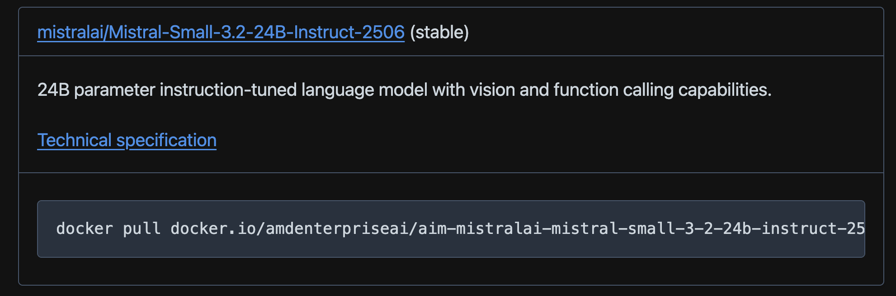
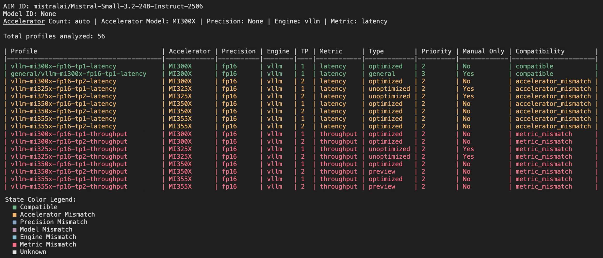
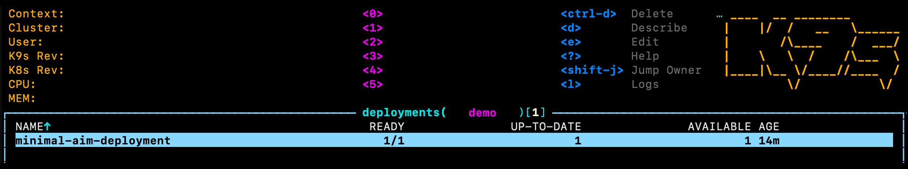

<!--
Copyright © Advanced Micro Devices, Inc., or its affiliates.

SPDX-License-Identifier: MIT
-->

# AIM Quick Start Guide: Discovery to First Deployment

This guide walks you through AMD Inference Microservices (AIMs), from finding models in the AIM catalog to deploying and running your first inference request with Docker and Kubernetes.

**What you will do:**

1. Find available AIMs in the catalog
2. Choose a model that fits your hardware
3. Pull the container image
4. Deploy the model with **Docker**
5. Deploy the model on **Kubernetes**
6. Verify the inference server is working for each deployment

## Prerequisites

This guide covers both Docker and Kubernetes deployments. The prerequisites depend on whether you are using Docker or Kubernetes. AIMs are available for AMD Instinct™ GPUs, AMD Radeon™ Pro GPUs, and EPYC™ CPUs. This guide was validated on AMD MI300X Instinct™, the approach however will be similar for the other accelerators.

| Requirement | Docker | Kubernetes |
|-------------|--------|--------------|
| AMD GPU with ROCm support (e.g., MI300X, MI325X, etc.) | Required for deployment (not for EPYC) | Required |
| Docker installed with accelerator access | Required | — |
| `kubectl` configured for your cluster | — | Required |
| `k9s` or similar for inspecting workloads | — | Optional |

**Note:** You do not need accelerator access to pull images or explore the AIM container images. On a machine without accelerator access, set `AIM_ACCELERATOR_MODEL` to override the detected accelerator model i.e. "simulate" your target hardware. See [Explore profiles](#explore-profiles).

## Find available AIMs and select a model

All published AIM containers are listed in the [AIM Catalog](../catalog/models.md). This guide uses **Mistral Small 3.2 24B Instruct 2506**, a publicly available model. Follow these steps to find the container image and review the AIM's technical specification:

1. Open the [AIM Catalog](../catalog/models.md).
2. Identify the accelerator (Instinct)
3. Browse models grouped by provider.
4. Each card shows the model name, a short description, a `docker pull` command, and a link to the model's technical specification.
5. Identify the card for the specified model (see Figure below)



As seen on the card, the container image is `amdenterpriseai/aim-mistralai-mistral-small-3-2-24b-instruct-2506:0.11.1`. Version tags (for example `0.11.1`) change with new releases.

Next, click the **Technical specification** link on the catalog card. The specification page tells you:

- Supported capabilities (chat, text generation, and so on)
- Available **profiles**: Pre-tuned configurations for specific GPUs, precisions, and latency/throughput targets
- GPU count and supported hardware

**To follow this guide**, confirm the model has an optimized profile for your hardware. If it does not, choose a different model from the catalog.

For a high-level overview, review the [Supported Accelerators](../accelerator_support.md) table to see which AIMs are optimized for your hardware.

## Pull the container image

AIM images are hosted on [Docker Hub](https://hub.docker.com/r/amdenterpriseai/aim-mistralai-mistral-small-3-2-24b-instruct-2506/tags) under the `amdenterpriseai` organization. Images are public, so you do not need Docker Hub credentials to pull them.

Pull the image:

```bash
docker pull amdenterpriseai/aim-mistralai-mistral-small-3-2-24b-instruct-2506:0.11.1
```

Wait for the download to complete.

## Docker experimentation

AMD Inference Microservices (AIMs) abstract away the complexities of configuring and serving AI models. An AIM automatically selects optimized runtime parameters based on your environment variables, hardware, and model specifications. Before deploying, you can preview that selection without starting the server.

### Explore profiles

After pulling the container image, use `list-profiles` to see every pre-tuned configuration available for the model, and `dry-run` to preview which profile AIM would select. If you do not have accelerator access, you can override the detected accelerator model i.e. "simulate" your target hardware on your local machine. Set `AIM_ACCELERATOR_MODEL` to simulate a target accelerator (for example `MI300X`). If you do have accelerator access, see [With accelerator access](#with-accelerator-access).

**List available profiles:**

Run the following command on your local machine to explore available profiles for MI300X:

```bash
docker run --rm \
  -e AIM_ACCELERATOR_MODEL=MI300X \
  amdenterpriseai/aim-mistralai-mistral-small-3-2-24b-instruct-2506:0.11.1 \
  list-profiles
```

The truncated output is shown in the Figure below. These results are for image version `0.11.1`. Depending on the hardware setup, you might need to set `-e AIM_ACCELERATOR_COUNT=1` (Override accelerator count for tensor parallel) to ensure the correct profile is selected.



The output lists every profile bundled with the image. Each row shows the target accelerator, precision, inference engine, tensor parallelism (TP), performance metric, and profile type (`optimized`, `general`, `unoptimized`, or `preview`). Latency is picked as the performance metric by default. The **Compatibility** column shows whether a profile matches your current environment variables. The `compatible` profiles are candidates for automatic selection; mismatches (for example `accelerator_mismatch` or `metric_mismatch`) explain why others are excluded. See [Supported Accelerators](../accelerator_support.md) for profile type definitions.

**Check profile selection results:**

Use `dry-run` to preview which profile AIM selects and the command it would use to start the inference engine without launching the server:

```bash
docker run --rm \
  -e AIM_ACCELERATOR_MODEL=MI300X \
  amdenterpriseai/aim-mistralai-mistral-small-3-2-24b-instruct-2506:0.11.1 \
  dry-run
```

Truncated output:

```text
- filename: vllm-mi300x-fp16-tp1-latency.yaml
  profile:
    aim_id: mistralai/Mistral-Small-3.2-24B-Instruct-2506
    model_id: mistralai/Mistral-Small-3.2-24B-Instruct-2506
    metadata:
      accelerator_count: 1
      accelerator_model: MI300X
      ...
    engine_args:
      ...
      ...
    env_vars:
      VLLM_ROCM_USE_AITER: '1'
      ...

...

exec python -m vllm.entrypoints.openai.api_server --model mistralai/Mistral-Small-3.2-24B-Instruct-2506 ......

```

You can also adjust other environment variables such as `AIM_ACCELERATOR_TYPE` (`gpu` (default) or `cpu`), `AIM_PRECISION` (precision, e.g. fp16), and `AIM_METRIC` (`latency`, `throughput`) to explore different deployment scenarios. See the [Docker deployment guide](../deployment_overview.md) for more examples.

### With accelerator access

On a machine with accelerator access, use the same commands but omit `AIM_ACCELERATOR_MODEL`. AIM detects the accelerator automatically. See below for an example with the `list-profiles` command:

```bash
docker run --rm \
  amdenterpriseai/aim-mistralai-mistral-small-3-2-24b-instruct-2506:0.11.1 \
  list-profiles
```

The results should be the same as before (if you are using MI300X).


## Deploy with Docker

Once you have validated profile selection, start the inference server on a machine with AMD GPU access. Certain models are gated
and require authentication to download them from Hugging Face. Mistral Small 3.2 24B is a public model, so no Hugging Face token is required. For gated models, add `-e HF_TOKEN=<YOUR_HUGGINGFACE_TOKEN>` to the command:

```bash
docker run \
  --device=/dev/kfd --device=/dev/dri \
  -p 8000:8000 \
  amdenterpriseai/aim-mistralai-mistral-small-3-2-24b-instruct-2506:0.11.1
```

Depending on the hardware setup, you might need to set `-e AIM_ACCELERATOR_COUNT=1` to ensure the correct profile is selected.

```text
(APIServer pid=1) INFO:     Started server process [1]
(APIServer pid=1) INFO:     Waiting for application startup.
(APIServer pid=1) INFO:     Application startup complete.
```

On first start:

1. AIM detects your GPU and selects a profile automatically.
2. Model weights are downloaded from Hugging Face.
3. The inference engine starts and listens on port `8000`.

Wait until the logs show the API is listening on port `8000`. The first startup is slower than subsequent runs while weights download from Hugging Face.

### Verify the Docker deployment

With the container running, confirm the server is healthy and send a test request.

List loaded models:

```bash
curl http://localhost:8000/v1/models
```

Truncated output:

```json
{
  "object": "list",
  "data": [
    {
      "id": "mistralai/Mistral-Small-3.2-24B-Instruct-2506",
      "object": "model",
      "owned_by": "vllm",
      "root": "mistralai/Mistral-Small-3.2-24B-Instruct-2506",
    }
  ]
}
```

You should see `mistralai/Mistral-Small-3.2-24B-Instruct-2506` in the response.

Send a chat request:

```bash
curl http://localhost:8000/v1/chat/completions \
  -H "Content-Type: application/json" \
  -d '{
    "model": "mistralai/Mistral-Small-3.2-24B-Instruct-2506",
    "messages": [
      {"role": "user", "content": "What is AI?"}
    ],
    "max_tokens": 100
  }'
```

Example output (truncated):

```json
{
  "model": "mistralai/Mistral-Small-3.2-24B-Instruct-2506",
  "choices": [
    {
      "index": 0,
      "message": {
        "role": "assistant",
        "content": "Artificial Intelligence (AI) refers to the simulation of human ..."
      },
      "finish_reason": "length"
    }
  ],
  "usage": {
    "prompt_tokens": 7,
    "completion_tokens": 100,
    "total_tokens": 107
  }
}
```

### Stop the container

Press `Ctrl+C` in the terminal where the container is running, or stop it from another terminal:

```bash
docker ps          # find the container ID
docker stop <CONTAINER_ID>
```

## Deploy with Kubernetes

The following steps deploy the same AIM on a Kubernetes cluster. Run these commands from your local machine with `kubectl` configured for the cluster.

### Confirm GPU availability (Instinct, Radeon)

Check that your cluster exposes AMD GPUs:

```bash
kubectl get nodes -o json | jq '.items[].status.allocatable'
```

Look for `"amd.com/gpu": "1"` (or a higher number) in the output.

If GPUs are not visible, install the [AMD GPU device plugin](https://github.com/ROCm/k8s-device-plugin):

```bash
kubectl create -f https://raw.githubusercontent.com/ROCm/k8s-device-plugin/master/k8s-ds-amdgpu-dp.yaml
```

```text
daemonset.apps/amdgpu-device-plugin-daemonset created
```

### Create a namespace

This guide deploys the workload to a namespace called `demo`. Create it with the command below. To use an existing namespace instead, update `$namespace` in the commands that follow.

```bash
kubectl create namespace demo
```

Set it as a variable for the rest of this section:

```bash
export namespace=demo
```

### Create a Hugging Face secret

A Hugging Face secret is optional for this public model. For consistency with gated-model deployments, this guide creates the `hf-token` secret and references it in the deployment manifest.

Create a secret named `hf-token` in the `demo` namespace:

```bash
kubectl create secret generic hf-token \
    --from-literal="hf-token=YOUR_HUGGINGFACE_TOKEN" \
    -n $namespace
```

```text
secret/hf-token created
```

### Create deployment and service manifests

Create a directory for your Kubernetes manifests:

```bash
mkdir -p aim-quickstart && cd aim-quickstart
```

Using your preferred text editor, create and save the following as `deployment.yaml`:

```yaml
apiVersion: apps/v1
kind: Deployment
metadata:
  name: minimal-aim-deployment
  labels:
    app: minimal-aim-deployment
spec:
  progressDeadlineSeconds: 3600
  replicas: 1
  selector:
    matchLabels:
      app: minimal-aim-deployment
  template:
    metadata:
      labels:
        app: minimal-aim-deployment
    spec:
      containers:
        - name: minimal-aim-deployment
          image: amdenterpriseai/aim-mistralai-mistral-small-3-2-24b-instruct-2506:0.11.1
          imagePullPolicy: Always
          env:
            - name: HF_TOKEN
              valueFrom:
                secretKeyRef:
                  name: hf-token
                  key: hf-token
          ports:
            - name: http
              containerPort: 8000
          resources:
            requests:
              memory: "16Gi"
              cpu: "4"
              amd.com/gpu: "1"
            limits:
              memory: "16Gi"
              cpu: "4"
              amd.com/gpu: "1"
          startupProbe:
            httpGet:
              path: /v1/models
              port: http
            periodSeconds: 10
            failureThreshold: 360
          livenessProbe:
            httpGet:
              path: /health
              port: http
          readinessProbe:
            httpGet:
              path: /v1/models
              port: http
          volumeMounts:
            - name: ephemeral-storage
              mountPath: /tmp
            - name: dshm
              mountPath: /dev/shm
      volumes:
        - name: ephemeral-storage
          emptyDir:
            sizeLimit: 256Gi
        - name: dshm
          emptyDir:
            medium: Memory
            sizeLimit: 32Gi
```

Create and save the following as `service.yaml`:

```yaml
apiVersion: v1
kind: Service
metadata:
  name: minimal-aim-deployment
  labels:
    app: minimal-aim-deployment
spec:
  type: ClusterIP
  ports:
    - name: http
      port: 80
      targetPort: 8000
  selector:
    app: minimal-aim-deployment
```

Applying these manifests creates a Deployment named `minimal-aim-deployment` that runs the Mistral Small 3.2 24B Instruct AIM.

Note: If you need help creating the Kubernetes manifests see the [public Github repository](https://github.com/amd-enterprise-ai/aim-build/blob/main/docs/docs-aim/mistralai/Mistral-Small-3.2-24B-Instruct-2506/DEPLOYMENT.md) for examples and details.

Before applying, review `deployment.yaml` for a few key fields:

- `metadata.name`: Deployment name
- `image`: The AIM container image from earlier in this guide
- `HF_TOKEN`: Loaded from the `hf-token` secret (required for gated models, optional for public ones)
- `amd.com/gpu`: Requests one AMD GPU for inference

If you skipped creating the Hugging Face secret, remove the `HF_TOKEN` environment variable block from `deployment.yaml`.

### Deploy to the cluster

Deploy the workload:

```bash
kubectl apply -f . -n $namespace
```

Expected output:

```text
deployment.apps/minimal-aim-deployment created
service/minimal-aim-deployment created
```

Wait for the pod to reach `Running` and `1/1` Ready. The first startup can take several minutes while model weights download.

```bash
kubectl get pods -n $namespace
```

Truncated output:

```text
NAME                          READY   STATUS
minimal-aim-deployment-...    1/1     Running
```

You can also monitor progress in `k9s`. Select the AIM pod and press `d` to describe the workload or `l` to view its logs.



### Verify the deployment

Port-forward the service to your local machine (leave this terminal open):

```bash
kubectl port-forward service/minimal-aim-deployment 8000:80 -n $namespace
```

Leave this terminal open while you verify the deployment. Open a new terminal and run the following command:

```bash
curl http://localhost:8000/v1/models
```

The `/v1/models` response should list the loaded model. Truncated output below:

```json
{
  "object": "list",
  "data": [
    {
      "id": "mistralai/Mistral-Small-3.2-24B-Instruct-2506",
      "object": "model",
      "owned_by": "vllm",
      "root": "mistralai/Mistral-Small-3.2-24B-Instruct-2506",
    }
  ]
}
```

Then send a chat request:

```bash
curl http://localhost:8000/v1/chat/completions \
  -H "Content-Type: application/json" \
  -d '{
    "model": "mistralai/Mistral-Small-3.2-24B-Instruct-2506",
    "messages": [
      {"role": "user", "content": "What is AI?"}
    ],
    "max_tokens": 100
  }'
```

A successful response should return JSON like this (truncated):

```json
{
  "choices": [
    {
      "index": 0,
      "message": {
        "role": "assistant",
        "content": "Artificial Intelligence (AI) refers to the simulation of human intelligence..."
      },
      "finish_reason": "length"
    }
  ],
}
```

### Clean up

To remove the deployment and service, run:

```bash
kubectl delete -f . -n $namespace
```

```text
deployment.apps "minimal-aim-deployment" deleted
service "minimal-aim-deployment" deleted
```
