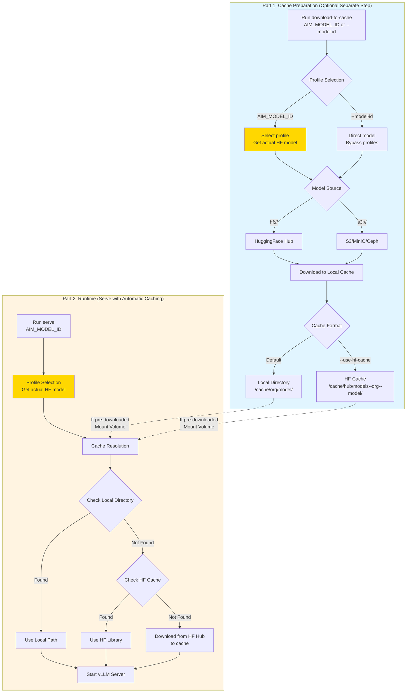
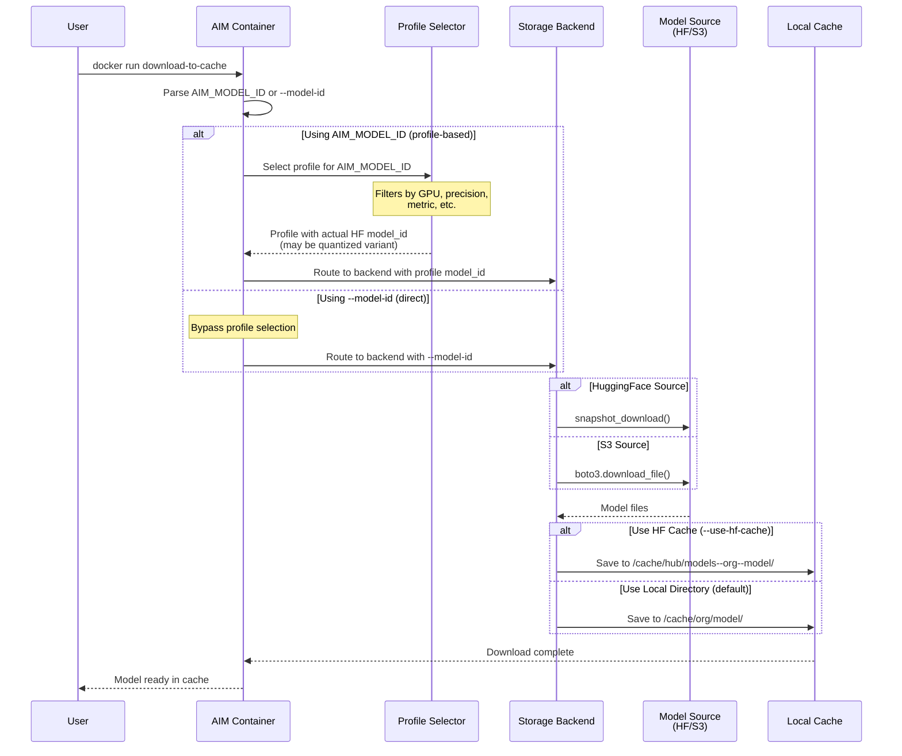

<!--
Copyright © Advanced Micro Devices, Inc., or its affiliates.

SPDX-License-Identifier: MIT
-->

# Model Caching

## Overview

AIM's model caching system has two distinct parts:

1. **Cache Preparation** - Download models from various sources to local cache (optional separate step)
2. **Cache Usage** - Serve models from cache at runtime (automatically downloads if not cached)

These parts can work together in different ways: you can pre-download models (cache preparation), or let the system download on first use (runtime caching). This document covers both approaches.



---

# Part 1: Cache Preparation (Optional Pre-Download)

## Model Sources

AIM can download models from multiple sources using storage backends:

- **HuggingFace Hub** (`hf://org/model`) - Public and gated models
- **S3/S3-compatible** (`s3://bucket/path`) - AWS S3, MinIO, Ceph, etc.

## Cache Formats

Downloaded models can be stored in two formats:

| Format | Local Directory (default) | HuggingFace Cache |
|--------|---------------------------|-------------------|
| **Directory** | `cache/org/model/` | `cache/hub/models--org--model/` |
| **Structure** | Simple, flat files | Blobs with symlinks |
| **Readable** | ✅ Yes | ⚠️ Complex |
| **Deduplication** | ❌ No | ✅ Yes |
| **Volume Mounting** | ✅ Per-model PVCs, per-model StorageClass | ⚠️ Single PVC, single StorageClass |
| **Data Locality** | ✅ Node-local storage for hot models | ⚠️ Shared storage only |
| **Best for** | Kubernetes, distributed systems, air-gapped | Shared storage, version mgmt |

**Both cache formats exist within the same base directory:**

```
/workspace/model-cache/                          # Single base cache directory
│
├── meta-llama/                                  # Local Directory Format (default)
│   └── Llama-3.1-8B-Instruct/                  # Flat org/model structure
│       ├── config.json
│       ├── model.safetensors
│       ├── tokenizer.json
│       └── ...
│
├── mistralai/                                   # Local Directory Format
│   └── Mistral-7B-v0.1/
│       ├── config.json
│       └── ...
│
└── hub/                                         # HuggingFace Cache Format (--use-hf-cache)
    ├── models--meta-llama--Llama-3.1-8B-Instruct/   # Nested under hub/
    │   ├── blobs/                              # Content-addressed storage
    │   │   ├── abc123...
    │   │   └── def456...
    │   ├── snapshots/                          # Version snapshots
    │   │   └── hash/                           # Symlinks to blobs
    │   └── refs/
    │       └── main
    │
    └── models--mistralai--Mistral-7B-v0.1/
        └── ...
```

> **Note:** Both formats coexist in the same cache directory. Local directory format uses flat `org/model/` paths, while HuggingFace format nests everything under `hub/` subdirectory with a special blob storage structure.

#### Local Directory: Flexible Mounting

Each model can have its own PVC with different StorageClasses, enabling fine-grained volume management and **performance tiers**:

```yaml
volumeMounts:
  - name: llama-cache
    mountPath: /workspace/model-cache/meta-llama/Llama-3.1-8B-Instruct
  - name: mistral-cache
    mountPath: /workspace/model-cache/mistralai/Mistral-7B-v0.1
volumes:
  - name: llama-cache
    persistentVolumeClaim:
      claimName: llama-pvc  # e.g., storageClassName: premium-ssd
  - name: mistral-cache
    persistentVolumeClaim:
      claimName: mistral-pvc  # e.g., storageClassName: standard-hdd
```

**Advantages**:
- Different StorageClasses per model (e.g., premium SSD for hot models, standard HDD for cold models)
- Data locality optimization (e.g., local-path or node-local StorageClasses for frequently-accessed models)
- Independent lifecycle management (backup, resize, delete per model)
- Cost and performance optimization through tiered storage selection

**HuggingFace Cache Format:**
- ⚠️ **Single cache limitation** - HF cache structure requires mounting entire cache directory
- ⚠️ **Cannot split models** - All models must be in the same PVC/volume
- ⚠️ **Single StorageClass** - All cached models constrained to same performance tier
  ```yaml
  # Example: Single cache PVC required
  volumes:
    - name: hf-cache
      persistentVolumeClaim:
        claimName: shared-hf-cache-pvc  # All models share same StorageClass
  volumeMounts:
    - name: hf-cache
      mountPath: /workspace/model-cache  # Mount entire cache
  ```

**Limitations**:
- Cannot assign different StorageClasses per model
- All models constrained to same performance tier and storage location
- Cannot optimize data locality (hot models close to compute nodes)
- Single lifecycle for all cached models

**Recommendation for Kubernetes:**
- Use **local directory format** for fine-grained volume management and performance optimization
- Enables per-model StorageClass selection:
  - **Hot models**: Node-local or replicated storage (e.g., `local-path`, `openebs-hostpath`) for minimal latency
  - **Warm models**: Regional/zonal storage (e.g., EBS, Persistent Disk) for balanced cost/performance
  - **Cold models**: Shared/archive storage (e.g., NFS, S3-backed) for cost efficiency
- Optimizes both cost and data locality in distributed deployments

## Download Command (`download-to-cache`)

Use this command to optionally pre-download models before serving. This is not required—models will automatically download at runtime if not cached.



## Command Options

**Flags:**
- `--model-id TEXT` - Explicit model source with protocol (`hf://org/model` or `s3://bucket/path`)
- `--use-hf-cache` - Store in HuggingFace cache format instead of local directory
- `--model-name TEXT` - Custom directory name (for S3 sources only)

**Environment Variables:**
- `AIM_MODEL_ID` - Model identifier for profile selection (required for `aim-base` container unless `--model-id` used)
- `AIM_PRECISION` - Desired precision (fp16, fp8, int4, etc.) - used for profile selection
- `AIM_GPU_MODEL` - GPU model (MI300X, MI325X, etc.) - used for profile selection
- `AIM_GPU_COUNT` - Number of GPUs - used for profile selection
- `AIM_METRIC` - Optimization target (latency, throughput) - used for profile selection
- `AIM_CACHE_PATH` - Cache directory (default: `/workspace/model-cache`)
- `HF_TOKEN` - HuggingFace token for gated models
- `AWS_ACCESS_KEY_ID` - AWS access key for S3 (optional if using IAM role)
- `AWS_SECRET_ACCESS_KEY` - AWS secret key for S3 (optional if using IAM role)
- `AWS_DEFAULT_REGION` - AWS region (default: `us-east-1`)
- `AWS_ENDPOINT_URL` - Custom S3 endpoint for S3-compatible storage like MinIO or Ceph

> **📝 Important:**
> - **Model-specific containers** (e.g., `aim:0.3.0-meta-llama-llama-3.1-8b-instruct-v20250930`) have the model ID baked in. Users specify high-level parameters (`AIM_PRECISION`, `AIM_GPU_MODEL`, `AIM_METRIC`) which trigger profile selection to determine the actual HuggingFace model to download (may be a quantized variant like `amd/Llama-3.1-8B-Instruct-FP8-KV`).
> - **Base container** (`aim-base`) requires `AIM_MODEL_ID` for profile selection.
> - Use `--model-id` to bypass profile selection and download a specific model directly.

## Download Examples

### HuggingFace Hub

```bash
# Profile-based download (model-specific container with baked-in model ID)
# User specifies high-level params (GPU, precision, metric) to select profile
# Profile determines actual model to download - may be quantized variant
docker run --rm \
  -e AIM_PRECISION="fp16" \
  -e AIM_GPU_MODEL="MI300X" \
  -e HF_TOKEN="your_token" \
  -v /host/cache:/workspace/model-cache \
  aim:0.3.0-meta-llama-llama-3.1-8b-instruct-v20250930 \
  download-to-cache
# → /workspace/model-cache/meta-llama/Llama-3.1-8B-Instruct/

# Direct download (bypasses profile selection, downloads exact model specified)
docker run --rm \
  -v /host/cache:/workspace/model-cache \
  aim-base:0.3.0 \
  download-to-cache --model-id hf://mistralai/Mistral-7B-v0.1
# → /workspace/model-cache/mistralai/Mistral-7B-v0.1/

# Use HuggingFace cache format with model-specific container
docker run --rm \
  -e AIM_PRECISION="fp16" \
  -e HF_TOKEN="your_token" \
  -v /host/cache:/workspace/model-cache \
  aim:0.3.0-meta-llama-llama-3.1-8b-instruct-v20250930 \
  download-to-cache --use-hf-cache
# → /workspace/model-cache/hub/models--meta-llama--Llama-3.1-8B-Instruct/
```

### S3 / S3-Compatible Storage

```bash
# Automatic directory naming from S3 path
docker run --rm \
  -e AWS_ACCESS_KEY_ID="key" \
  -e AWS_SECRET_ACCESS_KEY="secret" \
  -v /host/cache:/workspace/model-cache \
  aim-base:0.3.0 \
  download-to-cache --model-id s3://bucket/models/meta-llama/llama-3.1-8b
# → /workspace/model-cache/meta-llama/llama-3.1-8b/

# Custom directory naming (for S3 sources)
docker run --rm \
  -v /host/cache:/workspace/model-cache \
  aim-base:0.3.0 \
  download-to-cache \
    --model-id s3://bucket/deep/path/model \
    --model-name custom-org/my-model
# → /workspace/model-cache/custom-org/my-model/

# S3-compatible endpoints (MinIO, Ceph, etc.)
docker run --rm \
  -e AWS_ENDPOINT_URL="https://minio.example.com:9000" \
  -e AWS_ACCESS_KEY_ID="minioadmin" \
  -e AWS_SECRET_ACCESS_KEY="minioadmin" \
  -v /host/cache:/workspace/model-cache \
  aim-base:0.3.0 \
  download-to-cache --model-id s3://models/org/llama-7b
# → /workspace/model-cache/org/llama-7b/
```

### Without GPU Access

```bash
# Manually specify GPU when downloading without device access
# Model-specific container has model ID baked in
docker run --rm \
  -e AIM_GPU_MODEL="MI300X" \
  -e AIM_GPU_COUNT="1" \
  -e AIM_PRECISION="fp16" \
  -v /host/cache:/workspace/model-cache \
  aim:0.3.0-meta-llama-llama-3.1-8b-instruct-v20250930 \
  download-to-cache
# → /workspace/model-cache/meta-llama/Llama-3.1-8B-Instruct/
```

---

# Part 2: Runtime Serving (Automatic Cache Usage)

## Caching Strategies

### Pre-Warming (Optional Pre-Download for Predictable Startup)

Optionally download models before serving to eliminate startup delays:

```bash
# Pre-warm cache using model-specific container
docker run --rm \
  -e AIM_PRECISION="fp16" \
  -e HF_TOKEN="your_token" \
  -v /persistent/cache:/workspace/model-cache \
  aim:0.3.0-meta-llama-llama-3.1-8b-instruct-v20250930 \
  download-to-cache

# Serve immediately (no download delay)
docker run \
  -e AIM_PRECISION="fp16" \
  -v /persistent/cache:/workspace/model-cache \
  --device=/dev/kfd --device=/dev/dri -p 8000:8000 \
  aim:0.3.0-meta-llama-llama-3.1-8b-instruct-v20250930
```

**Benefits:**
- ✅ Predictable startup times
- ✅ No network dependency at runtime
- ✅ Faster container scaling
- ✅ Works in air-gapped environments

**Use Cases:** Production deployments, Kubernetes autoscaling, CI/CD pipelines

### Runtime Caching (Automatic Download on First Start)

Let the system automatically download the model on first use, subsequent containers reuse it:

```bash
# First container: Downloads to persistent volume
# Model-specific container with high-level params for profile selection
docker run \
  -e AIM_PRECISION="fp16" \
  -e AIM_METRIC="throughput" \
  -e HF_TOKEN="your_token" \
  -v /persistent/cache:/workspace/model-cache \
  --device=/dev/kfd --device=/dev/dri -p 8000:8000 \
  aim:0.3.0-meta-llama-llama-3.1-8b-instruct-v20250930
# (Downloads model on first start based on profile selection)

# Subsequent containers: Use cached model
docker run \
  -e AIM_PRECISION="fp16" \
  -e AIM_METRIC="throughput" \
  -v /persistent/cache:/workspace/model-cache \
  --device=/dev/kfd --device=/dev/dri -p 8001:8000 \
  aim:0.3.0-meta-llama-llama-3.1-8b-instruct-v20250930
# (No download, uses cache)
```

**Benefits:**
- ✅ Simpler workflow (no separate download step)
- ✅ Cache shared across containers automatically
- ✅ Good for development/testing

**Tradeoffs:**
- ⚠️ First container has unpredictable startup time
- ⚠️ Requires network access at startup
- ⚠️ May cause issues with tight orchestration timeouts

**Use Cases:** Development environments, exploratory workloads, single-instance deployments

## How Cache Resolution Works

At runtime, AIM resolves models in this order:

1. **Local directory**: `{AIM_CACHE_PATH}/org/model/`
   - If found: Use local path directly
   - Sets `--served-model-name org/model` for API consistency
2. **HuggingFace cache**: `{HF_HOME}/hub/`
   - If found: HF libraries handle resolution automatically
   - If not found: Downloads from HuggingFace Hub to cache

**Environment Variables:**
- `AIM_CACHE_PATH` - Base directory (default: `/workspace/model-cache`)
- `HF_HOME` - HuggingFace cache (default: `/workspace/model-cache`)
- `HF_TOKEN` - HuggingFace token for gated models

**For S3 models** (when `AIM_MODEL_ID` starts with `s3://`):
- `AWS_ACCESS_KEY_ID` - AWS access key (optional if using IAM role)
- `AWS_SECRET_ACCESS_KEY` - AWS secret key (optional if using IAM role)
- `AWS_DEFAULT_REGION` - AWS region (default: `us-east-1`)
- `AWS_ENDPOINT_URL` - Custom S3 endpoint for S3-compatible storage like MinIO or Ceph

> **Note:** If models are pre-downloaded using `download-to-cache`, runtime serving doesn't require S3 credentials since models are served from local cache.

---

# Part 3: Integration Patterns

## Shared Cache for Multiple Models

Pre-download multiple models to a shared volume:

```bash
# Download models to shared cache using model-specific containers
docker run --rm \
  -e AIM_PRECISION="fp16" \
  -e HF_TOKEN="token" \
  -v /shared/cache:/workspace/model-cache \
  aim:0.3.0-meta-llama-llama-3.1-8b-instruct-v20250930 \
  download-to-cache

docker run --rm \
  -e AIM_PRECISION="fp16" \
  -e HF_TOKEN="token" \
  -v /shared/cache:/workspace/model-cache \
  aim:0.3.0-mistralai-mistral-7b-v0.1-v20250930 \
  download-to-cache

# Serve any model from the shared cache
docker run \
  -e AIM_PRECISION="fp16" \
  -v /shared/cache:/workspace/model-cache \
  --device=/dev/kfd --device=/dev/dri -p 8000:8000 \
  aim:0.3.0-meta-llama-llama-3.1-8b-instruct-v20250930
```

## Air-Gapped Deployment

Download on connected system, transfer to air-gapped environment:

```bash
# On connected system - download models using model-specific container
docker run --rm \
  -e HF_TOKEN="token" \
  -v /transfer/cache:/workspace/model-cache \
  aim:0.3.0-meta-llama-llama-3.1-8b-instruct-v20250930 \
  download-to-cache

# Transfer cache to air-gapped system
rsync -av /transfer/cache/ airgapped-host:/data/cache/

# On air-gapped system - serve from cache
docker run \
  -v /data/cache:/workspace/model-cache \
  --device=/dev/kfd --device=/dev/dri -p 8000:8000 \
  aim:0.3.0-meta-llama-llama-3.1-8b-instruct-v20250930
```

---

# Part 4: Reference

## API Consistency

Models are served with standard naming regardless of cache format:
```bash
curl http://localhost:8000/v1/completions \
  -H "Content-Type: application/json" \
  -d '{"model": "meta-llama/Llama-3.1-8B-Instruct", "prompt": "Hello"}'
```

## Troubleshooting

**Model not found:**
1. Verify directory structure: `{cache_dir}/org/model/`
2. Check model files exist: `config.json`, weights, etc.
3. Enable debug: `-e AIM_DEBUG=true`

**Check cache resolution:**
```bash
docker run \
  -e AIM_PRECISION="fp16" \
  -v /host/cache:/workspace/model-cache \
  aim:0.3.0-meta-llama-llama-3.1-8b-instruct-v20250930 dry-run
```
Look for `--model` argument in output to see resolved path.
